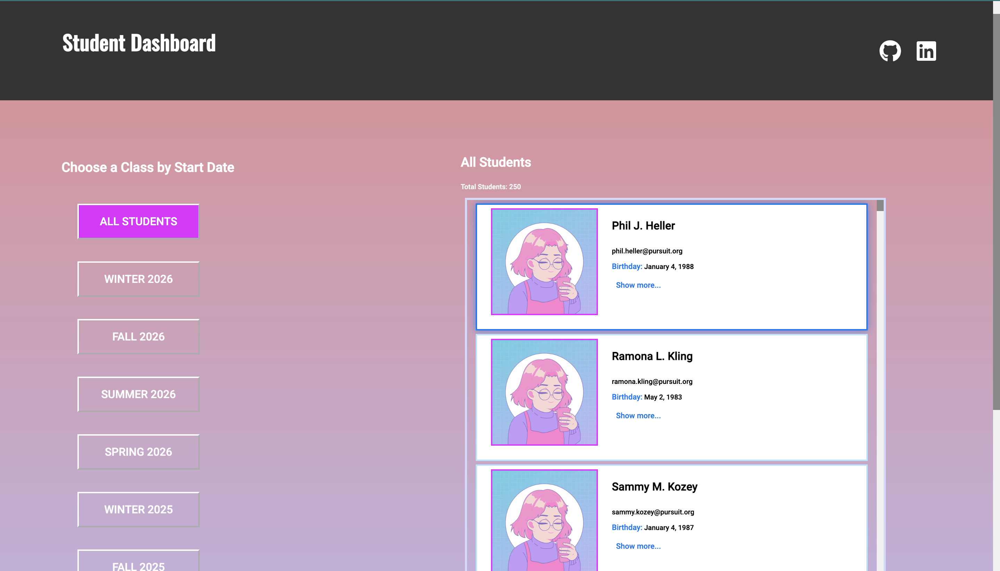
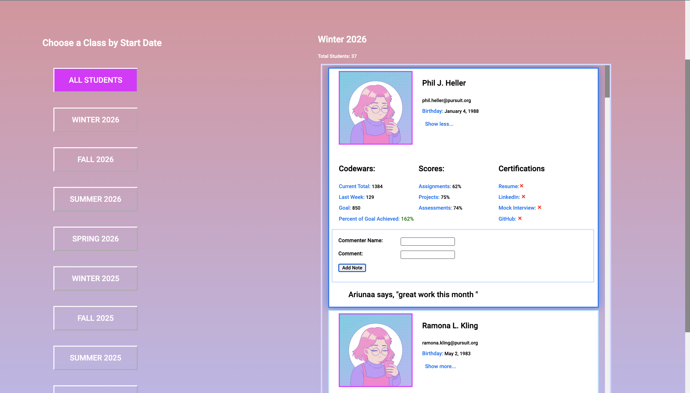

# Student Dashboard  &#129299;

Web page built with React, utilizing dummy JSON data of students. The app sorts the students based on their cohort year and season, with cohorts sorted in descending order. Additionally, it provides the functionality to leave comments for each student.

### Features

 - Displays a list of students along with their cohort year, season, and individual student information.

- Allows users to leave comments for each student, providing a way to add additional notes or feedback.

- Automatically sorts the students based on their cohort information.
Cohorts are arranged in descending order, allowing for easy identification of the latest cohorts.

### Technologies Used 
- React: JavaScript library for building user interfaces.
- Dummy JSON Data: Simulated student data is used for demonstration purposes.

### Getting Started

To run the project locally, follow these steps:

- Clone the repository: 
`git clone https://github.com/ariunaamy/student_dashboard`

- Install dependencies: 
`npm install`

- Start the development server: 
`npm start`

- Open the web page in your browser: http://localhost:3000

Feel free to explore the code and make any modifications 
to suit your needs. :) !

